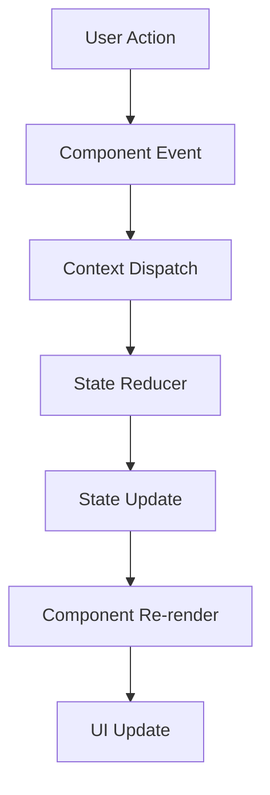
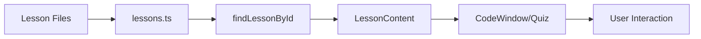
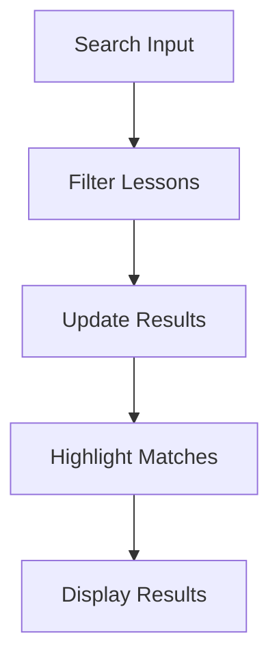
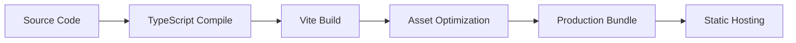
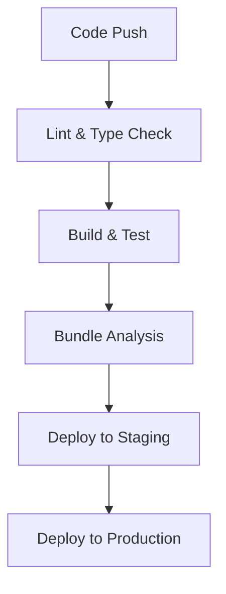

# 🏗️ Interactive Python Learning Platform - Architecture Documentation

## 📋 **Table of Contents**
1. [System Overview](#system-overview)
2. [Technology Stack](#technology-stack)
3. [Project Structure](#project-structure)
4. [Component Architecture](#component-architecture)
5. [Data Flow](#data-flow)
6. [State Management](#state-management)
7. [Lesson Content Architecture](#lesson-content-architecture)
8. [Performance Considerations](#performance-considerations)
9. [Security Architecture](#security-architecture)
10. [Deployment Architecture](#deployment-architecture)

---

## 🎯 **System Overview**

The Interactive Python Learning Platform is a modern, React-based educational application designed to teach Python programming, web development frameworks (Flask/FastAPI), and data science skills through interactive lessons, code examples, and quizzes.

### **Core Features:**
- 📚 **17+ Interactive Lessons** across 4 categories
- 💻 **Live Code Examples** with simulated execution
- 🧠 **Interactive Quizzes** with explanations
- 📊 **Progress Tracking** and search functionality
- 🔍 **Syntax Highlighting** and responsive design
- ⚡ **Real-time Updates** with Hot Module Replacement

---

## 🛠 **Technology Stack**

### **Frontend Framework**
- **React 18** - Component-based UI library
- **TypeScript** - Type-safe JavaScript development
- **Vite** - Fast build tool and development server

### **UI & Styling**
- **CSS3** - Custom styling with CSS Grid/Flexbox
- **Lucide React** - Modern icon library
- **React Syntax Highlighter** - Code syntax highlighting
- **Framer Motion** - Animations and transitions

### **State Management**
- **React Context API** - Global state management
- **useReducer Hook** - Complex state logic management
- **Custom Hooks** - Reusable state logic

### **Development Tools**
- **ESLint** - Code linting
- **TypeScript Compiler** - Type checking
- **Vite HMR** - Hot Module Replacement

---

## 📁 **Project Structure**

```
python-learning-platform/
├── public/                          # Static assets
│   ├── vite.svg                     # Favicon
│   └── index.html                   # HTML template
│
├── src/                             # Source code
│   ├── components/                  # React components
│   │   ├── layout/                  # Layout components
│   │   │   ├── Header.tsx           # Navigation header
│   │   │   ├── MainInterface.tsx    # Main content layout
│   │   │   └── Sidebar.tsx          # Navigation sidebar
│   │   ├── lessons/                 # Lesson-specific components
│   │   │   └── LessonContent.tsx    # Lesson display component
│   │   └── ui/                      # Reusable UI components
│   │       ├── CodeWindow.tsx       # Static code display
│   │       ├── InteractiveCode.tsx  # Interactive code editor
│   │       └── Quiz.tsx             # Quiz component
│   │
│   ├── data/                        # Application data
│   │   ├── lessons/                 # Lesson content modules
│   │   │   ├── python-lessons.ts    # Python curriculum
│   │   │   ├── flask-lessons.ts     # Flask framework lessons
│   │   │   ├── fastapi-lessons.ts   # FastAPI lessons
│   │   │   └── data-analyst-lessons.ts # Data analysis curriculum
│   │   └── lessons.ts               # Main lessons index
│   │
│   ├── hooks/                       # Custom React hooks
│   │   └── useAppContext.tsx        # Global state management
│   │
│   ├── types/                       # TypeScript type definitions
│   │   └── index.ts                 # Application types
│   │
│   ├── utils/                       # Utility functions
│   │   └── (future utilities)       # Helper functions
│   │
│   ├── App.tsx                      # Main App component
│   ├── App.css                      # Global styles
│   └── main.tsx                     # Application entry point
│
├── docs/                            # Documentation
│   ├── Architecture.md              # This file
│   ├── Contribution.md              # Contribution guidelines
│   ├── PendingItems.md              # Pending features/tasks
│   └── ContextAware.md              # Context-aware features
│
├── package.json                     # Dependencies and scripts
├── tsconfig.json                    # TypeScript configuration
├── vite.config.ts                   # Vite configuration
└── README.md                        # Project overview
```

---

## 🧩 **Component Architecture**

### **Component Hierarchy**
```
App
├── AppProvider (Context)
    └── MainInterface
        ├── Header
        │   ├── Search functionality
        │   └── Keyboard shortcuts
        ├── Category Tabs
        └── Content Area
            ├── Sidebar
            │   └── Lesson Navigation
            └── LessonContent
                ├── CodeWindow
                ├── InteractiveCode
                └── Quiz
```

### **Component Responsibilities**

#### **Layout Components**
- **Header**: Global navigation, search, shortcuts
- **MainInterface**: Tab management, layout orchestration
- **Sidebar**: Category-specific lesson navigation

#### **Content Components**
- **LessonContent**: Lesson rendering and navigation
- **CodeWindow**: Static code display with syntax highlighting
- **InteractiveCode**: Editable code with simulated execution
- **Quiz**: Interactive quiz with explanations

#### **State Management**
- **AppProvider**: Global state distribution
- **useAppContext**: State access and mutations

---

## 🔄 **Data Flow**

### **Application State Flow**


### **Lesson Content Flow**


### **Search Flow**


---

## 🗂 **State Management**

### **Global State Structure**
```typescript
interface AppState {
  currentCategory: string;      // Active category tab
  currentLesson: string;        // Active lesson ID
  searchTerm: string;          // Search query
  searchResults: SearchResult[]; // Search results
  progress: ProgressData;       // User progress tracking
}
```

### **State Actions**
- `SET_CURRENT_CATEGORY` - Switch between categories
- `SET_CURRENT_LESSON` - Navigate to specific lesson
- `SET_SEARCH_TERM` - Update search query
- `SET_SEARCH_RESULTS` - Update search results
- `UPDATE_PROGRESS` - Track lesson completion

### **Context Provider Pattern**
```typescript
// Global state accessible throughout the app
const { state, dispatch } = useAppContext();

// State mutations through reducer
dispatch({ type: 'SET_CURRENT_LESSON', payload: lessonId });
```

---

## 📚 **Lesson Content Architecture**

### **Modular Content Structure**
Each category has its own file for maintainability:
- `python-lessons.ts` - Python programming concepts
- `flask-lessons.ts` - Flask web framework
- `fastapi-lessons.ts` - FastAPI framework
- `data-analyst-lessons.ts` - Data analysis skills

### **Lesson Data Schema**
```typescript
interface Lesson {
  id: string;                    // Unique identifier
  title: string;                 // Lesson title
  subtitle: string;              // Difficulty and description
  meta: LessonMeta;             // Duration, difficulty
  content: {
    explanation: string;         // Concept explanation
    codeExample: CodeExample;    // Static code sample
    interactiveCode: {           // Editable code
      defaultCode: string;       // Initial code
      simulatedOutput: string;   // Expected output
    };
    quiz: Quiz;                  // Interactive quiz
  };
}
```

### **Progressive Difficulty**
- 🟢 **Beginner** - Fundamental concepts
- 🟡 **Intermediate** - Practical applications
- 🔵 **Advanced** - Complex implementations
- 🟣 **Expert** - Production-ready patterns

---

## ⚡ **Performance Considerations**

### **Code Splitting**
- **Lazy Loading**: Lessons loaded on-demand
- **Dynamic Imports**: Reduce initial bundle size
- **Tree Shaking**: Remove unused code

### **Memory Management**
- **Component Cleanup**: Proper useEffect cleanup
- **Event Listener Management**: Add/remove listeners
- **State Optimization**: Minimize re-renders

### **Bundle Optimization**
- **Vite Bundling**: Fast development builds
- **Production Builds**: Minification and compression
- **Asset Optimization**: Efficient static asset handling

### **Rendering Performance**
- **React.memo**: Prevent unnecessary re-renders
- **useMemo/useCallback**: Expensive calculation caching
- **Virtual Scrolling**: Large content list optimization

---

## 🔒 **Security Architecture**

### **Content Security**
- **XSS Prevention**: Sanitized user inputs
- **Content Validation**: Type-safe lesson content
- **Safe HTML Rendering**: Controlled HTML output

### **Client-Side Security**
- **TypeScript Safety**: Compile-time error prevention
- **Input Validation**: User input sanitization
- **State Immutability**: Predictable state updates

### **Development Security**
- **Dependency Scanning**: Regular security audits
- **Code Linting**: Security pattern enforcement
- **Build Validation**: Pre-deployment checks

---

## 🚀 **Deployment Architecture**

### **Build Process**


### **Environment Configuration**
- **Development**: Hot reload, source maps
- **Production**: Minification, optimization
- **Testing**: Unit test environment

### **Hosting Considerations**
- **Static Hosting**: Vercel, Netlify, GitHub Pages
- **CDN Integration**: Global content delivery
- **Cache Strategy**: Efficient asset caching

### **CI/CD Pipeline**


---

## 🔮 **Future Architecture Considerations**

### **Scalability Plans**
- **Micro-frontend Architecture**: Independent lesson modules
- **API Integration**: Backend service integration
- **Real-time Features**: WebSocket implementation
- **Offline Support**: Progressive Web App features

### **Advanced Features**
- **User Authentication**: Progress persistence
- **Analytics Integration**: Learning analytics
- **AI-Powered Features**: Personalized recommendations
- **Multi-language Support**: Internationalization

### **Technical Debt Management**
- **Regular Refactoring**: Code quality maintenance
- **Dependency Updates**: Security and performance
- **Architecture Reviews**: Quarterly assessments
- **Performance Monitoring**: Real-world metrics

---

*This architecture documentation is maintained as the platform evolves. Last updated: January 2024* 